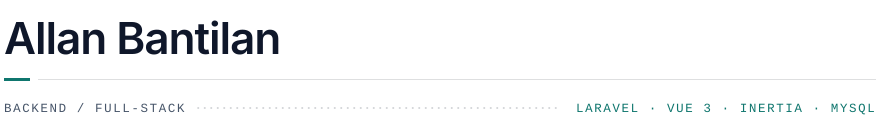
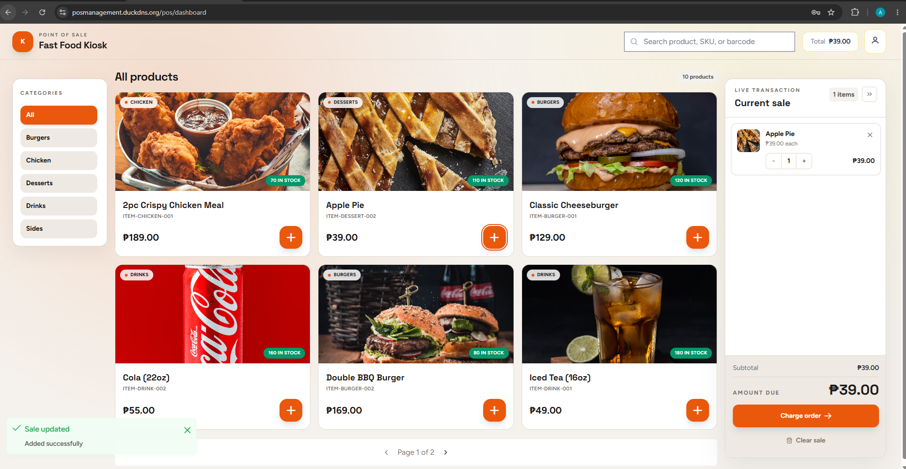
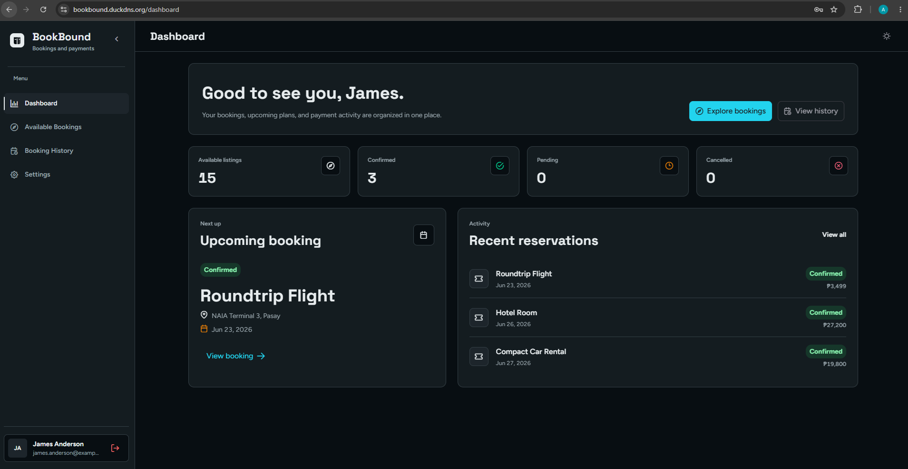
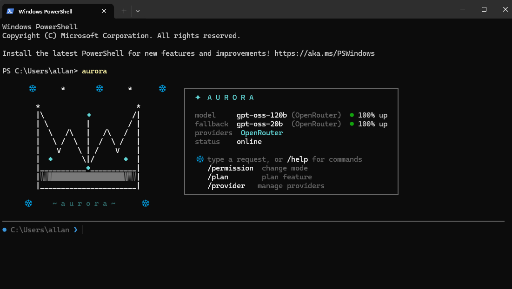

<picture>
  <source media="(prefers-color-scheme: dark)" srcset="assets/banner-dark.svg">
  
</picture>

Laravel and MySQL on the backend, Vue 3 and Inertia on the front. Most of what I've
shipped handles money — checkouts, bookings, refunds, stock counts — so I build for the
case where being wrong is expensive, not the case where the demo works.

Open to backend and full-stack roles.

## Work

### POS Management System

A cashier app for shops. Staff search products, ring up sales, take cash or online
payments, and print receipts, while owners track stock and view sales reports.

`Laravel` `Vue 3` `Inertia` `MySQL` &nbsp;·&nbsp; [Code](https://github.com/allanbantilan/pos-management-system-web) &nbsp;·&nbsp; [Live](https://posmanagement.duckdns.org)

### Bookbound

An online booking app. Customers find listings, reserve and pay online, and manage or
cancel bookings, while owners handle reservations, refunds, and payments.

`Laravel` `Vue 3` `Tailwind` `MySQL` &nbsp;·&nbsp; [Code](https://github.com/allanbantilan/booking-system-web) &nbsp;·&nbsp; [Live](https://bookbound.duckdns.org)

### Aurora AI CLI

A CLI coding agent with PHP and Laravel-aware workflows. Interactive and one-shot modes,
file and shell tools, multiple AI providers with fallback, and permission modes for safe
edits.

`Node.js` `JavaScript` &nbsp;·&nbsp; [Code](https://github.com/allanbantilan/aurora-ai-cli)

## Stack

**Backend** &nbsp; `PHP` `Laravel` `MySQL` `REST` `OpenAPI`

**Frontend** &nbsp; `Vue 3` `Inertia` `TypeScript` `Tailwind`

**Admin panels** &nbsp; `Filament` `Laravel Nova`

**Mobile** &nbsp; `React Native` `Expo`

**Tools** &nbsp; `Git` `Docker` `Postman` `Playwright` `Jira`

## Elsewhere

[Portfolio](https://allan-bantilan-portfolio.vercel.app/) &nbsp;·&nbsp; [LinkedIn](https://www.linkedin.com/in/allan-bantilan-3765993b1/) &nbsp;·&nbsp; [Résumé](https://drive.google.com/file/d/1vBtUSiFIrShB4aeOLxvgRiW-PtYWw7Xw/view?usp=sharing)
